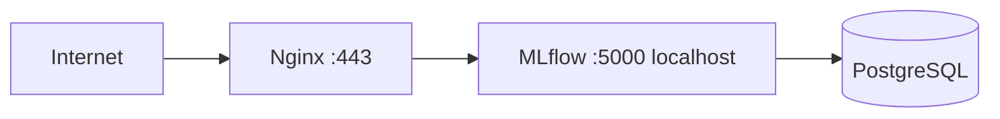
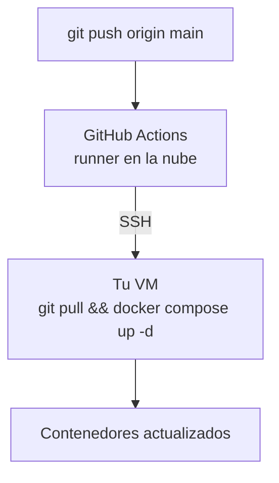

# MLflow Tracking Server — mlflow.angelfeliz.com

Production-ready MLflow Tracking Server on a single VM: persistent
PostgreSQL backend, basic auth, Nginx reverse proxy, and SSL via
Let's Encrypt. Deployed and managed with Docker Compose.

## Architecture



## Stack

* MLflow v3.15.2
* PostgreSQL 16
* SQLite (auth store, persisted)
* Nginx + Certbot
* Docker Compose

## Deploy

```bash
cp .env.example .env                 # fill with secrets (openssl rand -hex 32)
cp basic_auth.ini.example basic_auth.ini
chmod +x scripts/*.sh
./scripts/deploy.sh

```

## CI/CD: Push to Auto-Deploy



## Connect from Python

```bash
export MLFLOW_TRACKING_URI=[https://mlflow.angelfeliz.com](https://mlflow.angelfeliz.com)
export MLFLOW_TRACKING_USERNAME=angel.esteban.feliz
export MLFLOW_TRACKING_PASSWORD=<password>

```

```python
import mlflow

mlflow.set_tracking_uri("[https://mlflow.angelfeliz.com](https://mlflow.angelfeliz.com)")
mlflow.set_experiment("my-experiment")

with mlflow.start_run():
    mlflow.log_param("alpha", 0.5)
    mlflow.log_metric("auc", 0.87)

```

## Scripts

* `deploy.sh` — first-time deploy + SSL
* `backup.sh` — Postgres + artifacts + auth DB
* `restore.sh` — restore from a backup

## Verify locally

```bash
# 1. No secrets in git
git ls-files | grep -E "(\.env$\vert{}basic_auth\.ini$)"    # must be empty

# 2. Compose is valid
docker compose config > /dev/null && echo OK

# 3. Both containers are healthy
docker compose up -d && sleep 70 && docker compose ps

# 4. Auth is enforced (401 without credentials)
curl -s -o /dev/null -w "%{http_code}\n" \
  -X POST [http://127.0.0.1:5000/api/2.0/mlflow/experiments/search](http://127.0.0.1:5000/api/2.0/mlflow/experiments/search) \
  -H "Content-Type: application/json" -d '{}'
```

## Design notes

* MLflow bound to `127.0.0.1` — all traffic goes through Nginx with SSL.
* MLflow 3.x enforces host validation; `--allowed-hosts "*"` is set in `docker-compose.yml` to support proxying via Nginx domain.
* Three persistent volumes: `postgres-data`, `mlflow-artifacts`,
`basic-auth-db`. The last one is often forgotten and causes user
loss on restart if not mounted.
* Native MLflow basic auth — no ShinyProxy. Per-user permissions on
experiments and registered models, no extra layers.

## Pasos para reiniciar el contenedor y aplicar los cambios

```bash
docker compose up -d mlflow --force-recreate
```


## Author

Angel Feliz — angel.esteban.feliz@gmail.com
